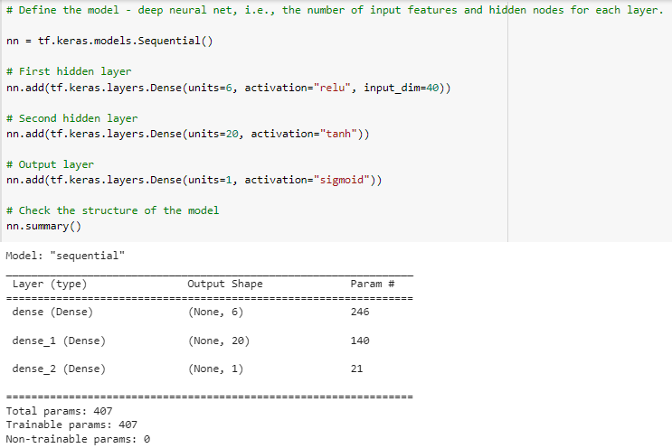

# Report on the Neural Network Model

# Overview of the analysis:

The nonprofit foundation Alphabet Soup would like to develop a model to select the applicants for funding with the best chance of success in their ventures. The model is developed by a deep neural network model by analyzing features in the provided dataset to predict whether the application will be successful if funded by Alphabet Soup.

## Data Preprocessing
What variable(s) are the target(s) for your model?

- The target for the model is 'IS_SUCCESSFUL'.

What variable(s) are the features of your model?

- The feature for the model is 'APPLICATION_TYPE',' AFFILIATION', 'CLASSIFICATION', 'USE_CASE',' ORGANIZATION', 'STATUS', 'INCOME_AMT', 'SPECIAL_CONSIDERATIONS', 'ASK_AMT'.
What variable(s) should be removed from the input data because they are neither targets nor features?

- The variables that should be removed are 'EIN' and 'NAME'.

## Compiling, Training, and Evaluating the Model

How many neurons, layers, and activation functions did you select for your neural network model, and why?

- The neural network model includes 27 neurons, 2 hidden layers, and 3 activation functions (relu, tanh, sigmoid). To achieve a good balance between model complexity and performance.

 
Were you able to achieve the target model’s performance?

- Yes, the highest model performance I achieved is Accuracy: 72.9%

What steps did you take in your attempts to increase model performance?

I used the following step to increase model performance
- add column NAME as a feature
- add more neurons to a hidden layer
- use different activation functions for the hidden layers.

# Summary:
The overall results of the deep learning model slightly increased after many attempts of optimization from accuracy 72.9% to 75%. The result can predict the 'IS_SUCCESSFUL' result for application evaluation. The dataset includes many features to be considered so it needs a machine learning ability to learn complex and non-linear relationships between the input features and the target.

However, the deep learning model is often considered a "dark side" and hard to interpret, due to its complexity. Alternatively, we may use other machine learning algorithms, such as Decision Trees and Random Forests. The code 'AlphabetSoupCharity_Optimisation' demonstrates these two models and achieved about 73.1% and 73.7% accuracy, which is slightly lower than the deep learning model but a bit easy to visualize.

